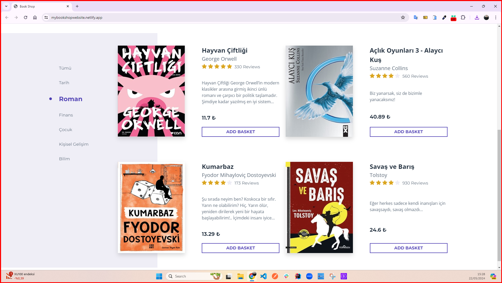

<h1>Book Shop Website</h1>

I designed a brand new website for book lovers using HTML5, CSS3, Bootstrap, and Javascript. You can easily filter books by type and instantly find the book you are looking for. You can add the books you like to the cart and remove them whenever you want, or increase or decrease the quantity. The prices of books in your cart are automatically updated with each addition or removal. In this way, you will always be informed about the most up-to-date prices.

<h2> The following technologies were used in the frontend development phase of my site: </h2>

- HTML5
- CSS3
- Bootstrap
- Javascript

<h2> Visit My Book Shop Website: </h2>

- https://mybookshopwebsite.netlify.app/

<h4>GIF</h4>

<h4>IMAGES</h4>

